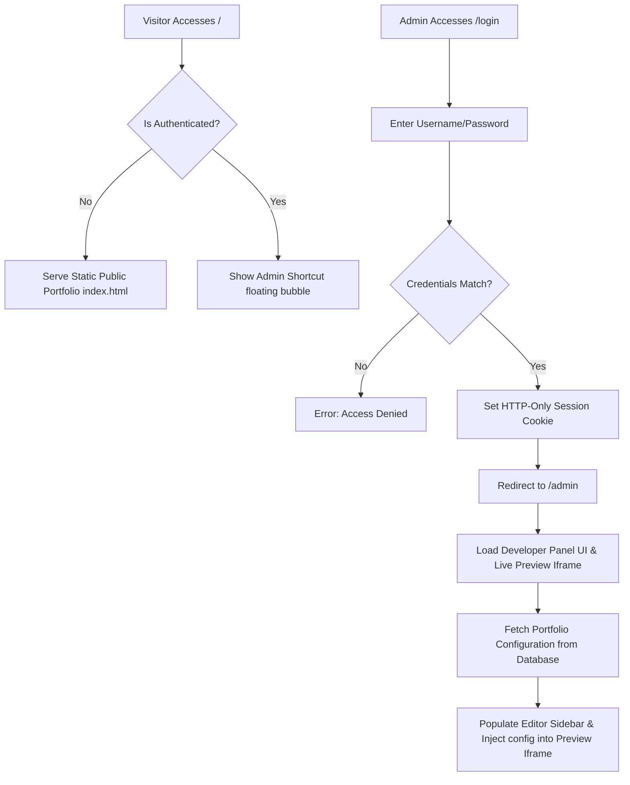
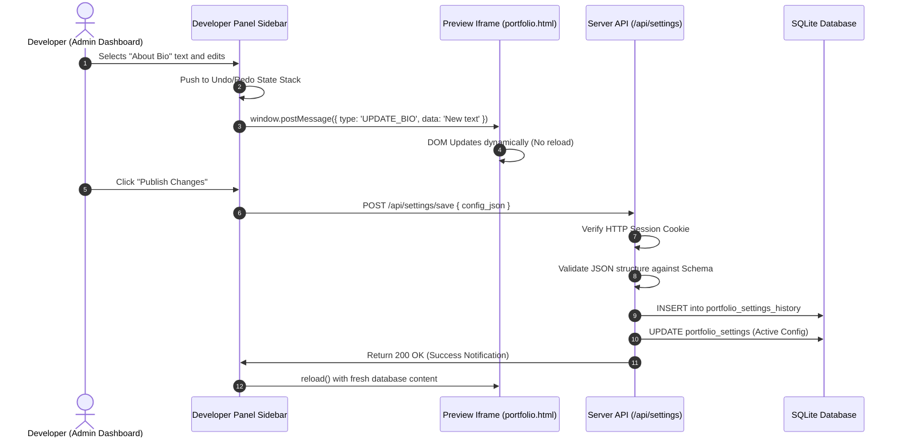
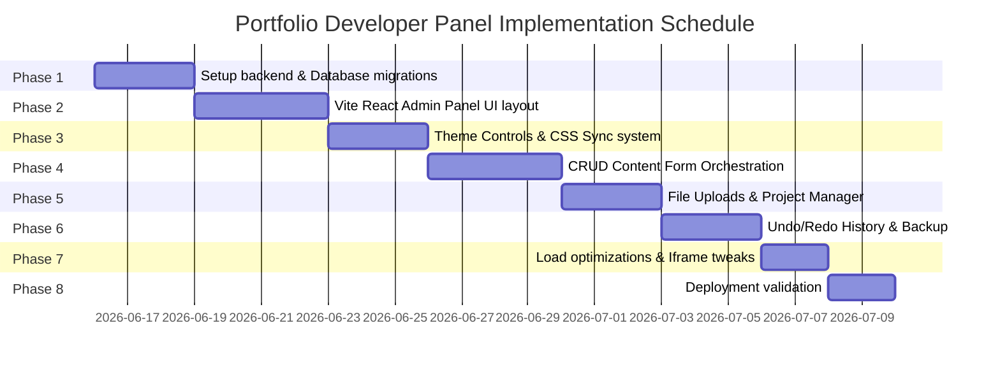

# Product Architecture & Implementation Design: Developer Panel

This document outlines the Product Requirement Document (PRD), Application Flow, Tech Stack, Database Schema, and Phase-by-Phase Roadmap for implementing a hidden **Developer Panel** inside the portfolio website. This panel serves as an in-browser, low-code layout and content engine (similar to Webflow/Framer) that enables live editing of colors, typography, layouts, animations, and section text/media without manually changing source files.

---

## 1. PRODUCT REQUIREMENT DOCUMENT (PRD)

### Product Overview
The Developer Panel is an integrated, administrative dashboard embedded directly within the portfolio. Accessible via a secure, hidden route or key combination, it provides a visual design interface to manage site configuration dynamically. It shifts the portfolio from a hardcoded static site to a dynamic, database-driven web application with a live visual editor.

### Vision
To empower developers to iterate, customize, audit, and showcase their portfolio configurations in real time, serving as both a personal utility and an impressive interactive demo of full-stack engineering capabilities.

### Objectives
*   **Zero-Code Updates:** Enable updating portfolio text, images, projects, layout structures, and themes dynamically.
*   **Immediate Visual Feedback:** Provide a WYSIWYG editing environment with instant rendering across multiple viewport simulations.
*   **Data Integrity & Versioning:** Protect the portfolio state with robust undo/redo capabilities, schema validation, configuration backups, and restore operations.
*   **High Performance:** Ensure the public portfolio loading speed is unaffected by administrative libraries or editor assets.

### Problem Statement
Static portfolios require developers to modify source code, commit changes, and trigger redeployments just to correct a typo, swap an image, or adjust a color. This flow is slow, lacks version tracking, doesn't allow safe previewing of edits, and prevents dynamic customizations during client pitches.

### Target Users & Personas
*   **Aditya Soni (Owner/Developer):** CS student and developer who needs to rapidly adjust portfolio details, add new security writeups or projects, and test aesthetic variations instantly.
*   **Prospective Clients/Recruiters:** Tech experts who value high-fidelity, interactive dashboards and want to see proof of advanced CRUD engineering, security safeguards, and design system architecture.

### Business & User Goals
*   **User Goal:** Decrease portfolio project upload and edit time from 15 minutes (code, build, deploy) to under 30 seconds.
*   **Business/Showcase Goal:** Demonstrate enterprise-grade application design, state management, and backend safety features to recruiters.

---

### Core & Advanced Features

#### Theme Management & Color System
*   **Global Preset Manager:** Switch between preset configurations (e.g., Cyberpunk Neon, Classic Dark, Glassmorphism Sleek, Minimal Light).
*   **Color System:** Edit primary, secondary, accent, surface, and background colors. Supports HEX, HSL, and CSS variable mapping.
*   **Real-time Synchronization:** Colors immediately compile into CSS custom variables (`--color-brand-primary`, etc.) on the preview DOM.

#### Typography Management
*   **Font Family Controls:** Choose between curated Google Fonts combinations (Display, Sans-serif, Cursive, Mono).
*   **Text Sizing & Spacing:** Adjust base sizes, line heights, letter spacings, and font weights across header levels (`h1`, `h2`, `h3`) and body paragraphs.

#### Animation Controls
*   **Transition Presets:** Modify transition durations, easing functions, and triggers (e.g., scroll trigger, hover, entrance).
*   **Disable Switches:** Globally toggle heavy WebGL, 3D particles, or complex GSAP transitions to save battery or fit lower-end screens.

#### Layout Controls
*   **Section Ordering:** Drag-and-drop hierarchy editor to reorder sections (e.g., move *Education* above *Skills*).
*   **Grid & Flex Configuration:** Adjust paddings, column spans, alignments, and element spacing in grid items.

#### Section Content Editors
*   **Hero Editor:** Modify main headlines, tags, subheadings, dynamic call-to-actions, and background assets.
*   **About Editor:** Manage profile picture URLs, bio text blocks, and descriptive badges.
*   **Skills Editor:** Add/remove tool categories, update progress scores, assign technical icons, and group strengths.
*   **Experience & Education Editors:** Full CRUD timeline management to add, update, delete, or hide educational milestones and jobs.
*   **Projects Manager:** Manage project names, screenshots, tags, links, and detailed structural case studies.
*   **Contact & Social Links Manager:** Configure contact endpoints, booking calendar integrations (Calendly/Custom), and social anchor links.

#### Global Design System & Preview Engine
*   **Responsive Viewport Simulator:** Live toggles to simulate Desktop ($1280px+$), Tablet ($768px$), and Mobile ($375px$) layouts directly inside the editor canvas.
*   **Draft & Publish Lifecycle:** Maintain a `draft` state in memory/localStorage. Clicking "Publish" commits configuration changes permanently to the SQLite database.
*   **Export/Import & Backups:** Download the complete JSON schema representing the portfolio configuration, and restore from a backup file in one click.
*   **Undo/Redo Stack:** Multi-step history management for editor edits.
*   **Version History:** Track published timestamps and rollback to previous database snapshots.

---

### Functional Requirements
*   **FR-1:** The editor panel must load only when an authenticated session cookie or JWT is present.
*   **FR-2:** Changes made in the editor panel must reflect instantly in an `<iframe>` preview window using messaging pipelines (`postMessage`).
*   **FR-3:** Images must be uploaded via drag-and-drop, saved directly to disk, and referenced via path columns in SQLite.
*   **FR-4:** Configuration versions must be stored in a dedicated SQLite table (`portfolio_settings_history`) to facilitate rollbacks.
*   **FR-5:** The database must serialize structural page layouts into a single, structured JSON document or structured relational rows.

### Non-Functional Requirements
*   **NFR-1 (Performance):** Visitors must load the public portfolio page in under 1.2s. Editor assets (e.g., visual controls, drag-drop libs) must be lazy-loaded only within the admin route.
*   **NFR-2 (Security):** The admin endpoint and API edits must be secured by Session tokens. Password values must be hashed (BCrypt), and API parameters must enforce type casting to prevent SQL injection.
*   **NFR-3 (Availability):** Local backups of portfolio content must be written to disk in a separate folder (`./backups`) weekly.
*   **NFR-4 (Accessibility):** Generated themes must maintain WCAG AA color contrast guidelines, verified by automated contrast calculation algorithms built into the color picker.

---

### User Stories & Acceptance Criteria

```
As a: Portfolio Owner
I want to: Modify the primary brand color from pink to emerald green using a visual color picker
So that: I can match the theme to a specific company during an interview.
```
*   **Acceptance Criteria:**
    1.  Opening the Theme panel shows a color picker for the Primary color.
    2.  Dragging the cursor on the color picker instantly updates the preview frame's brand variables.
    3.  Clicking "Publish" updates the database value and updates the style rules for future visitors.

```
As a: Portfolio Owner
I want to: Reorder my "Achievements" block to appear before "Education" via drag-and-drop
So that: I can highlight my latest hackathon wins.
```
*   **Acceptance Criteria:**
    1.  The layout configuration tab displays a list of active sections.
    2.  Sections can be re-arranged vertically.
    3.  The layout preview shifts dynamically to match the new order.
    4.  Saving persists the index value in the database.

---

### Edge Cases & Risks
*   **Corrupted JSON Configuration:** If an invalid file import is uploaded, it could brick the client layout. *Mitigation:* Schema validation via JSON Schema Validator (e.g., Ajv or custom parsing checks) before committing uploads.
*   **WebGL Crash in Iframe:** Frequent layout/dimension changes inside the device simulator could overwhelm Three.js rendering loops. *Mitigation:* Dispose of WebGL context and restart rendering loop during resizing events, or throttle iframe resize event handlers.
*   **Concurrent Modification:** Editing the database settings in two windows simultaneously. *Mitigation:* Optimistic locking using a `version` or `updated_at` check.

---

## 2. APPLICATION FLOW

### Architectural Flow Map



### Content Editing & Design Synchronization Flow



### Detailed Screen Navigation Paths
1.  **`/` (Public Portfolio Home):** Show public sections. If the admin cookie exists, render a secure widget in the bottom-right corner reading: `"Open Editor"`.
2.  **`/login` (Login Interface):** Standard clean form. Successful validation moves the user to `/admin`.
3.  **`/admin` (The Developer Panel Master Dashboard):**
    *   **Sidebar Layout:** Tabs containing:
        *   *Design System:* Brand Colors, Font Selection, Border Radii, Easing options.
        *   *Layout:* Drag-and-drop listing of sections, padding controls, visible toggles.
        *   *Content Manager:* Accordion fields mapping to Hero, About, Skills, Education, Experience, Projects.
        *   *Systems:* Export/Import, SQLite Backup, Rollback Logs, SEO keywords.
    *   **Editor Panel View:** Embedded viewport simulator showcasing real-time responsive frames:
        *   Desktop ($100\%$ width inside flexbox container).
        *   Tablet ($768\text{px}$ mock device overlay).
        *   Mobile ($375\text{px}$ mock device frame).

---

## 3. TECH STACK

We recommend a clean, production-ready, lightweight stack designed to support fast client loads and rich developer controls without loading bloated frameworks.

| Layer | Component | Selected Technology | Rationale |
| :--- | :--- | :--- | :--- |
| **Frontend** | Framework | **React.js (via Vite)** | Excellent component encapsulation, state binding, and ecosystem support for panels and editors. |
| **Frontend** | Styling | **Tailwind CSS & CSS Variables** | Simplifies live styling customization. Tailwind handles system utility rules; color picker links straight to CSS custom variables in `:root`. |
| **Frontend** | State | **Zustand** | Light, fast state store that handles editing states, history stacks (undo/redo), and handles syncing with the iframe easily. |
| **Frontend** | Drag-n-Drop | **@hello-pangea/dnd** | Solid library to rearrange timeline elements and layout sections. |
| **Backend** | Framework | **Node.js (Express & TypeScript)** | High performance, lightweight routing. TypeScript guarantees model safety and interface structure consistency. |
| **Database** | Database Engine | **SQLite** | Local file database requiring zero external service overhead. Perfect for keeping configuration states, messages, and portfolio lists. |
| **Database** | Caching | **Memory Cache (Lru-Cache)** | Cache active portfolio configuration. Clears immediately when an administrator publishes a change. |
| **Auth** | Security | **Secure Cookie + Session Store** | Standard HttpOnly cookie validation prevent scripts from hijacking credentials. Session matches active values. |
| **Storage** | Asset Server | **Local File System / AWS S3** | Local disk storage is perfect for smaller portfolio image sizes. Supports fallback configurations for AWS S3. |
| **DevOps** | Containerization | **Docker** | Encapsulates Server script, static assets, and SQLite DB configuration for quick hosting deployment. |

---

## 4. BACKEND SCHEMA & API DESIGN

### Database Architecture (SQLite Schema)

The database structure handles relational configurations, logging audits, and timeline items cleanly.

```sql
-- 1. Authentication & Users
CREATE TABLE IF NOT EXISTS users (
    id INTEGER PRIMARY KEY AUTOINCREMENT,
    username TEXT UNIQUE NOT NULL,
    password_hash TEXT NOT NULL,
    email TEXT UNIQUE NOT NULL,
    created_at TIMESTAMP DEFAULT CURRENT_TIMESTAMP
);

-- 2. Master Portfolio Configuration Table (Saves Active Customizations)
CREATE TABLE IF NOT EXISTS portfolio_settings (
    id INTEGER PRIMARY KEY CHECK (id = 1), -- Hardcoded to 1 to enforce single-row configuration
    theme_preset TEXT DEFAULT 'dark',
    primary_color TEXT DEFAULT '#f43f5e',
    secondary_color TEXT DEFAULT '#8b5cf6',
    accent_color TEXT DEFAULT '#f59e0b',
    background_color TEXT DEFAULT '#050811',
    surface_color TEXT DEFAULT '#0c1122',
    font_display TEXT DEFAULT 'Oswald',
    font_body TEXT DEFAULT 'Inter',
    animations_enabled INTEGER DEFAULT 1, -- Boolean (0 or 1)
    layout_sections_order TEXT DEFAULT 'about,education,skills,now,projects,contact', -- CSV order of sections
    seo_title TEXT DEFAULT 'Portfolio',
    seo_description TEXT DEFAULT 'Developer Portfolio',
    analytics_id TEXT DEFAULT '',
    updated_at TIMESTAMP DEFAULT CURRENT_TIMESTAMP
);

-- 3. Content Table: Projects Manager
CREATE TABLE IF NOT EXISTS projects (
    id INTEGER PRIMARY KEY AUTOINCREMENT,
    title TEXT NOT NULL,
    description TEXT NOT NULL,
    image_url TEXT,
    github_link TEXT,
    live_link TEXT,
    tags TEXT, -- Comma-separated list
    sort_order INTEGER DEFAULT 0,
    is_visible INTEGER DEFAULT 1,
    created_at TIMESTAMP DEFAULT CURRENT_TIMESTAMP
);

-- 4. Content Table: Education timeline
CREATE TABLE IF NOT EXISTS education (
    id INTEGER PRIMARY KEY AUTOINCREMENT,
    degree TEXT NOT NULL,
    institution TEXT NOT NULL,
    timeline TEXT NOT NULL,
    description TEXT,
    sort_order INTEGER DEFAULT 0,
    is_visible INTEGER DEFAULT 1
);

-- 5. Content Table: Experience timeline
CREATE TABLE IF NOT EXISTS experience (
    id INTEGER PRIMARY KEY AUTOINCREMENT,
    role TEXT NOT NULL,
    company TEXT NOT NULL,
    timeline TEXT NOT NULL,
    description TEXT,
    sort_order INTEGER DEFAULT 0,
    is_visible INTEGER DEFAULT 1
);

-- 6. Settings Backup/History for Rollbacks & Audits
CREATE TABLE IF NOT EXISTS portfolio_settings_history (
    version_id INTEGER PRIMARY KEY AUTOINCREMENT,
    created_at TIMESTAMP DEFAULT CURRENT_TIMESTAMP,
    modified_by TEXT NOT NULL,
    settings_snapshot TEXT NOT NULL -- Full JSON copy of active configs
);
```

---

### REST API Documentation

#### 1. Authentication
*   **`POST /api/login`**
    *   *Payload:* `{"username": "aditya", "password": "..."}`
    *   *Response:* `200 OK` (sets `Set-Cookie: session_id=...; HttpOnly`) or `401 Unauthorized`.

#### 2. Settings Management
*   **`GET /api/settings`** (Public)
    *   *Response:* Returns the active row of `portfolio_settings` plus related `projects`, `education`, `experience` records compiled in a single layout tree object.
*   **`POST /api/settings/save`** (Protected)
    *   *Payload:* Updates theme details, CSS variable configurations, or metadata.
    *   *Body JSON:*
        ```json
        {
          "primary_color": "#10b981",
          "font_display": "Outfit",
          "layout_sections_order": "about,skills,projects,contact"
        }
        ```
    *   *Response:* `200 OK` + `{"status": "success", "message": "Settings updated"}`

#### 3. Projects CRUD API
*   **`POST /api/projects`** (Protected)
    *   *Payload:* `{"title": "App", "description": "Details", "tags": "React,Node", ...}`
    *   *Response:* `201 Created`
*   **`PUT /api/projects/:id`** (Protected)
    *   *Response:* `200 OK`
*   **`DELETE /api/projects/:id`** (Protected)
    *   *Response:* `200 OK`

#### 4. Backup & Version Rollback API
*   **`GET /api/system/backup`** (Protected)
    *   *Response:* Serves direct download link of SQLite db or compiled JSON dump.
*   **`POST /api/system/rollback`** (Protected)
    *   *Payload:* `{"version_id": 42}`
    *   *Response:* Reverts `portfolio_settings` to selected snapshot state.

---

### File Upload Architecture
For saving image updates (e.g. avatars, project cards) without using heavy frameworks:
1.  Admin selects image via file explorer.
2.  Frontend uploads via `multipart/form-data` to `/api/media/upload`.
3.  The server validates image extension (PNG, JPG, WebP only) and sizes (< 3MB).
4.  Saves to `./uploads/[uuid]-[filename]`.
5.  API returns the local server URL (`/uploads/abc-profile.png`) to be referenced directly inside the SQL database columns.

---

## 5. IMPLEMENTATION ROADMAP & CHECKLISTS

### Phase-by-Phase Timeline



---

### Detailed Implementation Phases

#### Phase 1: Foundation & Architecture
*   **Objective:** Set up project structure, convert backend routes to Express (TypeScript), and prepare SQLite migrations.
*   **Tasks:**
    1.  Initialize Node.js Server container.
    2.  Write migrations code inside `./server/db/migrations.ts` to spin up necessary tables.
    3.  Create Express route framework with clean request handlers.
*   **Deliverables:** SQL migration scripts, database model validations, Express server skeleton code.
*   **Estimated Time:** 3 days
*   **Complexity:** Medium | **Priority:** High

#### Phase 2: Developer Panel UI Layout
*   **Objective:** Design and build the editor dashboard layout, embedding the responsive viewframe selector.
*   **Tasks:**
    1.  Create an `/admin` route served from React frontend.
    2.  Implement left-hand navigation sidebar (Dashboard, Customization, Sections, Storage).
    3.  Embed client portfolio view within an standard HTML `<iframe>`.
*   **Deliverables:** Visual administrative sidebar structure, iframe preview shell, responsive viewport scale buttons.
*   **Estimated Time:** 4 days
*   **Complexity:** High | **Priority:** High

#### Phase 3: Theme Controls & CSS Variable Integration
*   **Objective:** Connect visual color wheels and font family controls to live custom CSS variables inside the preview page.
*   **Tasks:**
    1.  Integrate Tailwind-friendly color pickers in the dashboard.
    2.  Implement `postMessage` protocol to update values inside the preview iframe dynamic stylesheet instantly on keypress.
*   **Deliverables:** Theme editor controllers, real-time styling updates without iframe reload.
*   **Estimated Time:** 3 days
*   **Complexity:** Medium | **Priority:** High

#### Phase 4: Content Management System Forms
*   **Objective:** Enable timeline adjustments, section toggling, and layout modifications.
*   **Tasks:**
    1.  Create text input boxes and markdown rich-text fields for About Bio, Hero Title, and Booking Calendars.
    2.  Implement drag-and-drop hierarchy listing to sort timelines.
*   **Deliverables:** Visual content editors with state binding.
*   **Estimated Time:** 4 days
*   **Complexity:** High | **Priority:** High

#### Phase 5: Projects Manager & Asset Storage
*   **Objective:** Build out projects archive grid control system and image upload pipelines.
*   **Tasks:**
    1.  Implement CRUD modal for Projects archive.
    2.  Establish upload endpoint with backend mime-filtering.
*   **Deliverables:** Project manager interface, secure local file storage, asset upload UI.
*   **Estimated Time:** 3 days
*   **Complexity:** Medium | **Priority:** High

#### Phase 6: Undo/Redo & Snapshot Backups
*   **Objective:** Implement configuration history management and data backups.
*   **Tasks:**
    1.  Add state stack trackers in Zustand to record actions.
    2.  Implement import/export JSON configuration buttons.
*   **Deliverables:** Version history database logs, JSON layout files import/export.
*   **Estimated Time:** 3 days
*   **Complexity:** High | **Priority:** Medium

#### Phase 7: Optimization & Iframe Refinement
*   **Objective:** Improve visual rendering times and reduce editor load overhead.
*   **Tasks:**
    1.  Set up client-side layout caching.
    2.  Lazy-load heavy admin dashboards from the public entry file.
*   **Deliverables:** Performance optimization reports, clean loading states.
*   **Estimated Time:** 2 days
*   **Complexity:** Low | **Priority:** Medium

#### Phase 8: Production Deployment
*   **Objective:** Deploy code within a container, secure access controls, and perform manual penetration tests.
*   **Tasks:**
    1.  Build Dockerfile.
    2.  Run vulnerability checks against SQL inputs.
*   **Deliverables:** Deployed containerized portfolio app, final system audit.
*   **Estimated Time:** 2 days
*   **Complexity:** Medium | **Priority:** High

---

### System Architecture & Directories

```
/portfolio-app
│
├── /server                 # Node.js + Express Backend
│   ├── /db                 # Database connections & SQLite schemas
│   ├── /routes             # API endpoints (Auth, Projects, Media, Settings)
│   ├── /middleware         # Token verification, secure logs, error handlers
│   ├── /uploads            # Location for uploaded media files
│   └── server.ts           # Main Express server entrypoint
│
├── /src                    # React Frontend (Vite)
│   ├── /components         # UI Component catalog (Cards, Modals)
│   │   └── /admin          # Developer Panel components (ColorPicker, SectionSort)
│   ├── /store              # State management (Zustand configuration stores)
│   ├── /styles             # index.css & global styling configs
│   ├── App.tsx             # Entry routing
│   └── main.tsx            # DOM initialization
│
├── Dockerfile              # Deployment configuration file
├── package.json            # Client and Server dependencies lists
└── tailwind.config.js      # Styling utility classes setups
```

---

### Comprehensive Checklist Matrix

#### Security Checklist
- [ ] Set `HttpOnly`, `Secure`, and `SameSite=Lax` headers on authorization cookies.
- [ ] Implement query parameter parsing validations to verify delete/update request values are clean integers (blocks SQL injection).
- [ ] Check file header magic bytes on uploaded assets instead of relying solely on the file extension string.
- [ ] Limit API endpoint requests using a rate-limiting middleware (e.g., `express-rate-limit`) to prevent brute-force attacks on the dashboard.

#### Verification & Testing Checklist
- [ ] Validate iframe connection controls across Safari, Firefox, and Chrome.
- [ ] Audit DB state preservation when simulating database disconnections.
- [ ] Test CSS variable updates under contrasting theme choices (ensures text readability is preserved).
- [ ] Confirm layout rendering hierarchy when loading empty project datasets.

#### Deployment Checklist
- [ ] Store active session secrets outside the codebase using environment variables.
- [ ] Ensure SQLite file path writes to a persistent container volume mount (prevents data loss during Docker updates).
- [ ] Set up daily database replication backups.
- [ ] Verify that admin script assets are not included in public script chunks.